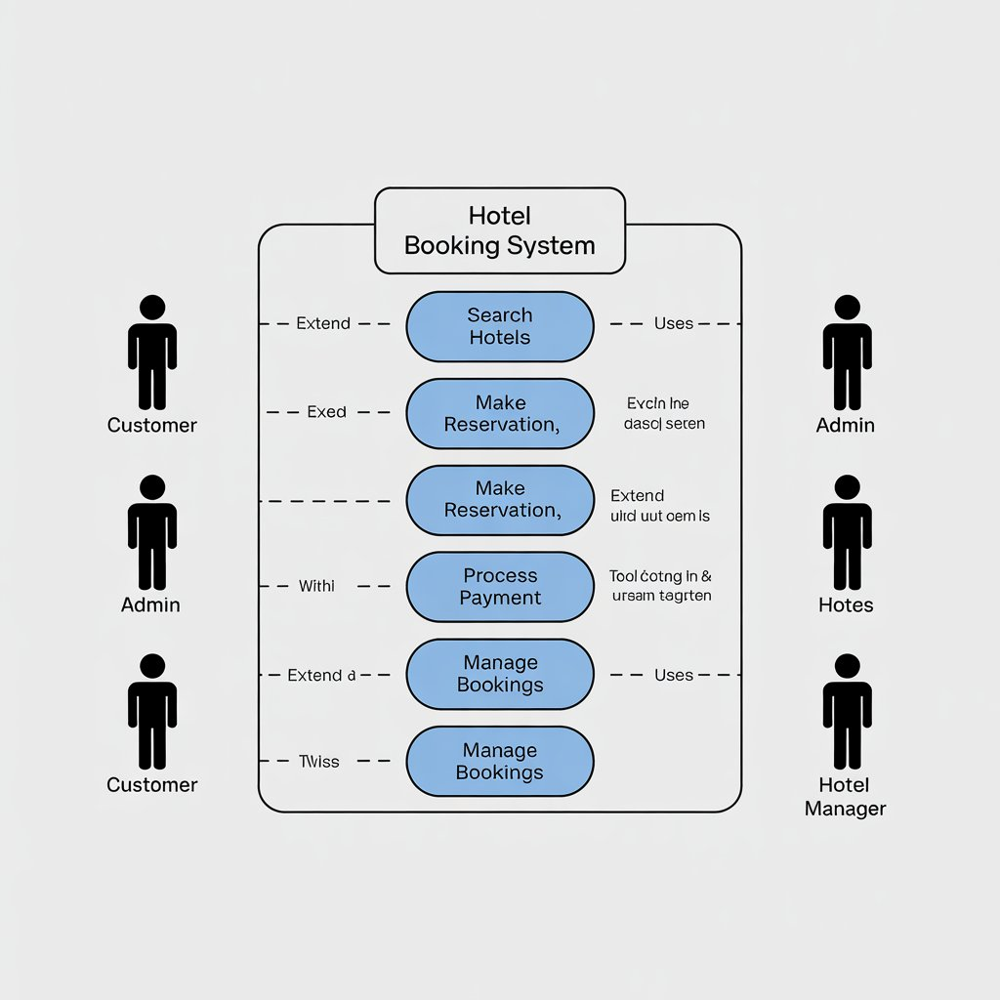

FeatureForge: Requirement Analysis for Booking Management System
1. Introduction

Repository purpose: Document and demonstrate Requirement Analysis in software development.

Focus: Booking Management System (similar to Airbnb/OYO).

Goals: Understand stakeholder needs, define functional and non-functional requirements, create diagrams, and define acceptance criteria.

2. What is Requirement Analysis?

Definition: Process of identifying, documenting, and managing stakeholder needs for a software project.
Requirement Analysis is the process of identifying, documenting, and managing the needs and expectations of stakeholders for a software project. It is a critical phase in the Software Development Lifecycle (SDLC), serving as the foundation for successful system design and implementation.

Categorization:

Functional Requirements: What the system should do (features, operations).

Non-Functional Requirements: How the system performs (performance, scalability, usability, security).

Importance:

Provides clarity and direction.

Reduces risks.

Ensures stakeholder alignment.

Supports project planning and quality assurance.

3. Why is Requirement Analysis Important?

Clarity and Alignment: Ensures shared understanding among team and stakeholders.

Risk Reduction: Identifies potential issues early to avoid costly errors.

Quality Assurance: Sets benchmarks for testing and validation.

4. Key Activities in Requirement Analysis

Requirement Gathering: Collect information from stakeholders and documentation.

Requirement Elicitation: Explore and clarify hidden or implied needs.

Requirement Documentation: Record requirements clearly using SRS, user stories, or structured lists.

Requirement Analysis and Modeling: Visualize requirements using use case diagrams, data flow diagrams, workflows.

### Booking System Use Case Diagram

Requirement Validation: Verify with stakeholders that documented requirements are accurate, feasible, and complete.

5. Types of Requirements
Functional Requirements

Define what the system should do.

Examples for Booking Management System:

User registration and authentication

Hotel search and filtering

Room availability check

Booking and reservation management

Payment processing

Notifications

Non-Functional Requirements

Define how the system performs.

Examples for Booking Management System:

Performance (handle high user load)

Scalability (support growth and peak times)

Availability (high uptime)

Security (protect data)

Usability (intuitive interface)

Maintainability (easy updates and modular design)

6. Use Case Diagrams

Definition: Visual representation of system functionality and interactions between actors and the system.

Benefits:

Clarifies requirements visually

Facilitates communication among stakeholders

Helps validate requirements

Defines system scope

Aids in planning and design

Acceptance Criteria

Acceptance Criteria are the specific conditions that a software product or feature must satisfy to be considered complete and acceptable by stakeholders. They are a critical part of Requirement Analysis because they:

Provide clear guidelines for developers on what needs to be implemented.

Help testers verify that the system meets the defined requirements.

Ensure alignment between stakeholders’ expectations and the delivered product.

Reduce ambiguity, scope creep, and misunderstandings during development.

Example: Checkout Feature in a Booking Management System

For a Checkout feature, example acceptance criteria could include:

Users must be able to select a payment method (credit card, debit card, or digital wallet).

The system must validate the payment information and return a success or error message.

A booking confirmation email must be sent to the user upon successful payment.

Users should be able to view their booking summary before finalizing payment.

All sensitive payment data must be securely encrypted and comply with PCI DSS standards.

